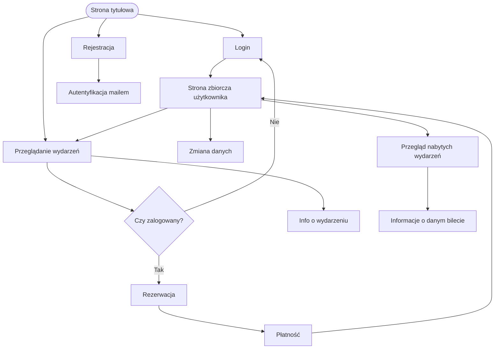

# jpydzr8-kulturalny-kod
```bash
python manage.py makemigrations
python manage.py migrate
python manage.py runserver
```


```mermaid
flowchart TD
    A(["Strona tytułowa"]) --> B["Login"] & C["Rejestracja"] & D["Przeglądanie wydarzeń"]
    B --> E["Strona zbiorcza użytkownika"]
    E --> D & H["Zmiana danych"] & I["Przegląd nabytych wydarzeń"]
    D --> M{"Czy zalogowany?"} & L["Info o wydarzeniu"]
    I --> J["Informacje o danym bilecie"]
    C --> K["Autentyfikacja mailem"]
    M -- Nie --> B
    M -- Tak --> G["Rezerwacja"]
    G --> N["Płatność"]
    N --> E
```
